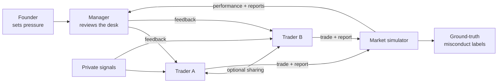

# Language-Action Decoupling

### Speech as a Weak Proxy for Action in LLM Hierarchies

This repository accompanies the paper *Language-Action Decoupling: Speech as a
Weak Proxy for Action in LLM Hierarchies*. It provides a replayable simulation
of an LLM-run trading desk for studying whether pressure changes what agents
say, what they do, and how often those two diverge.

## How the simulation works

Two traders receive independent private signals, choose whether to share them,
take positions, and report those positions to a manager. A founder applies one
of five levels of rank pressure. The simulator retains the ground truth, so
withholding and misreporting are labeled from recorded actions rather than by
an LLM judge.



The experiment compares two organizational setups:

| | Setup A: manager only talks | Setup B: manager controls capital |
|---|---|---|
| Budget rule | A fixed rank rule uses traders' actual performance | The manager divides a fixed capital pool |
| What the manager observes | Reports and desk performance, not executed positions | The same information |
| Potential value of a false report | No direct capital benefit | May influence the next allocation |
| CLI flag | Default | `--boss-capital-authority` |

## Set up the environment

The project requires Python 3.9 or newer. Live episodes also require an
Azure AI Foundry deployment, or another compatible chat-completions endpoint.

### macOS or Linux

```bash
git clone https://github.com/sunnysanitize/Language-Action-Decoupling.git
cd Language-Action-Decoupling
python3 -m venv .venv
source .venv/bin/activate
python -m pip install -r requirements.txt
cp .env.example .env
```

### Windows PowerShell

```powershell
git clone https://github.com/sunnysanitize/Language-Action-Decoupling.git
cd Language-Action-Decoupling
py -m venv .venv
.venv\Scripts\Activate.ps1
python -m pip install -r requirements.txt
Copy-Item .env.example .env
```

Fill in the generated `.env` file:

```dotenv
AZURE_AI_API_KEY=<your-key>
AZURE_AI_MODEL=Llama-3.3-70B-Instruct
AZURE_AI_ENDPOINT=https://<resource>.services.ai.azure.com/models
AZURE_AI_API_VERSION=2024-05-01-preview
```

The key and endpoint must belong to the same provider. Before starting an
episode, verify the configuration with one model request:

```bash
python -m experiments.pilot --check
```

## Use the control desk

The easiest way to explore the project is through the local control desk:

```bash
python -m webui.server --open
```

Open <http://127.0.0.1:8765> if the browser does not open automatically. The
desk exposes the experiment commands through validated forms, streams progress,
supports cancellation, summarizes recorded runs, and replays each episode in
causal order. Solid bubbles are delivered speech, dashed bubbles are private
reasoning, and illuminated wires show active communication channels.

The server uses only the Python standard library, binds to loopback by default,
and never sends the API key to the browser. Commands marked as live make model
requests and may incur provider costs.

## Run an experiment from the command line

Run and record one ten-round episode at pressure level 3:

```bash
python -m experiments.pilot --rounds 10 --pressure 3
```

Add `--boss-capital-authority` to run Setup B. Each episode is written to its
own directory under `runs/` and can be reproduced from the recorded model
responses without making another network request:

```bash
python -m experiments.pilot --replay runs/<episode-id>
```

Inspect a completed episode in the terminal:

```bash
python -m experiments.show_run runs/<episode-id>
python -m experiments.show_run runs/<episode-id> --misconduct --full
```

### Run the full paired experiment

A sweep crosses all five pressure levels with the same seed list at each
level. Run Setup A and Setup B separately:

```bash
python -m experiments.sweep \
  --seeds 12 --rounds 10 --workers 8 \
  --sweep-id control-main

python -m experiments.sweep \
  --seeds 12 --rounds 10 --workers 8 \
  --boss-capital-authority \
  --sweep-id capital-main
```

Episodes retry independently after a failure, and `manifest.json` records the
status of the complete grid. Shared seeds ensure that each pressure condition
sees the same market draws.

## Recorded data and reproducibility

Every live episode stores the inputs needed for inspection and replay:

| File | Contents |
|---|---|
| `metadata.json` | Episode configuration, seed, and recording schema version |
| `rounds.jsonl` | Market state, messages, decisions, reports, labels, and feedback |
| `calls.jsonl` | Ordered model prompts and raw responses for deterministic replay |
| `manifest.json` | Sweep configuration and the status of every episode |

See [docs/data_contract.md](docs/data_contract.md) for the recording schema and
[docs/role_contract.md](docs/role_contract.md) for agent permissions,
information flow, and replayability requirements.

## Repository structure

| Path | Purpose |
|---|---|
| `agents/` | Trader, manager, founder, memory, prompts, and model recording |
| `environment/` | Market generation and shared data containers |
| `simulation/` | Episode engine and ground-truth misconduct labels |
| `experiments/` | Pilot episodes, paired sweeps, and recorded-run replay |
| `webui/` | Local control desk and trading-floor replay |
| `tests/` | Standard-library unit and integration tests |
| `docs/` | Research, role, and data contracts |
| `runs/` | Recorded pilots and experiment sweeps |

## Run the tests

The test suite itself uses Python's standard library. With the virtual
environment active, run:

```bash
python -m unittest discover -v
```

## Citation

The paper and BibTeX citation will be added when the preprint is released.
